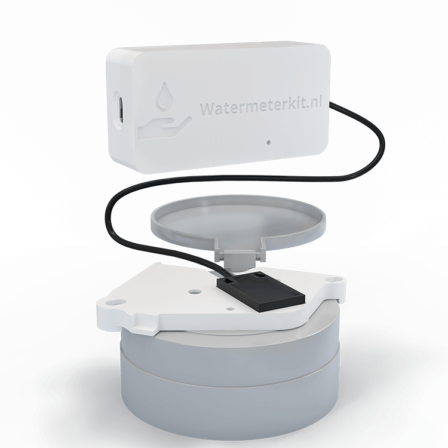

# WaterMeterKit for Home Assistant / ESPHome



WaterMeterKit is a compact ESPHome-based water meter sensor for Home Assistant. It measures real-time water usage from compatible analog water meters and is designed for fully local operation without cloud dependencies.

Product page: https://watermeterkit.nl/en

## How It Works

The WaterMeterKit uses a magnetic sensor to detect the rotating element on your analog water meter, counting each liter that passes through. Compatible with most major water meter brands including Actaris, Elster, Honeywell, Itron, Sensus and more.

Compatibility guide: https://watermeterkit.nl/en

## Key Features

- Real-time water usage tracking with pulse meter sensing
- Temperature and humidity sensing with HDC1080
- WiFi onboarding with captive portal fallback
- Improv Serial provisioning over USB
- Fully local operation with Home Assistant and ESPHome

## Hardware Versions

| Version | Chip | Connectivity | Description |
|---------|------|--------------|-------------|
| V1 | ESP8266 | WiFi | Compact water meter sensor for analog water meters |

## Variants

We publish one customer-facing firmware variant for the current hardware revision.

| Hardware | Variant | Description |
|----------|---------|-------------|
| V1 (ESP8266) | WiFi | Standard WiFi firmware with captive portal and Improv Serial |

## Getting Started

1. Install the WaterMeterKit on your water meter.
2. Flash the firmware with the web flasher or ESPHome CLI.
3. If WiFi is not configured yet, connect to the fallback hotspot.
4. Use Improv Serial over USB if you prefer wired provisioning.

Web flasher: https://smarthomeshop.io/en/firmware
Quick start guide: https://smarthomeshop.io/quick-start-watermeterkit

## OTA Note

If you see the error `ESP does not have enough space to store OTA file`, that is caused by ESP8266 1MB flash limitations.

For recovery or reflashing, use the USB web flasher:
- Connect the WaterMeterKit via USB-C
- Open https://smarthomeshop.io/en/firmware
- Select WaterMeterKit and flash the latest firmware

## Version History

- Customer-facing release notes: [CHANGELOG.md](CHANGELOG.md)
- GitHub Releases: https://github.com/smarthomeshop/watermeterkit/releases

## Repository Layout

```text
watermeterkit/
├── watermeterkit-v1/       # V1 ESPHome configurations
│   ├── base.yaml           # Shared configuration
│   ├── watermeterkit.yaml  # Main WiFi firmware
│   └── wifi.yaml
├── .github/workflows/      # Build and release automation
├── CHANGELOG.md            # Customer-facing firmware notes
└── images/
```

## Firmware Downloads

Pre-built firmware manifests are published on the `gh-pages` branch.

- V1 WiFi: `watermeterkit-v1-manifest.json`

## Sensors

| Sensor | Description |
|--------|-------------|
| Current Usage | Water flow rate in L/min |
| Total Consumption | Cumulative water usage in m³ |
| Temperature | Environment temperature |
| Humidity | Environment humidity |
| WiFi Signal | WiFi signal strength |
| Uptime | Device uptime |

## Contributing

PRs and issues are welcome. Please keep changes modular and follow ESPHome best practices.

## Support

- Product info and guides: https://watermeterkit.nl/en
- Store: https://smarthomeshop.io
- Community and support: https://smarthomeshop.io/discord

## License

This project is released under the CC BY-NC 4.0 license.


